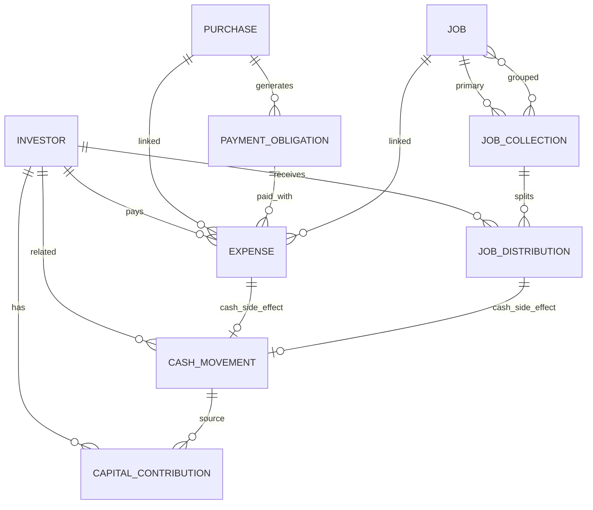

# Base de Datos (Modelo actual)

Documentación del esquema de datos de `backend/core/models.py`.

## 1. Motor y convenciones

- Motor: PostgreSQL
- ORM: Django
- PK por tabla: `id` (`BigAutoField`)
- Monedas del modelo: `ARS`, `USD`

## 2. Diagrama ER (alto nivel)

## 3. Tablas maestras

## `Investor`

- `name` (unique)
- `active`
- `notes`

Uso: socios/inversores que participan en gastos, capital y distribuciones.

## `Client`

- `name` (unique)
- `active`
- `notes`

Uso: catálogo de clientes para trabajos.

## `ExchangeRate`

- `date` (unique)
- `ars_per_usd`
- `source`
- `notes`

Uso: auditoría de tipo de cambio histórico.

## 4. Capital y caja

## `CashMovement`

Campos principales:
- `date`
- `direction` (`IN`, `OUT`)
- `category`:
- `JOB_COLLECTION`
- `FIELD_TEAM_PAYOUT`
- `PROFIT_REINVESTMENT`
- `CAPITAL_CONTRIBUTION`
- `CAPITAL_RESCUE`
- `INVESTOR_WITHDRAWAL`
- `EXPENSE`
- `PURCHASE_PAYMENT`
- `ADJUSTMENT`
- `currency` (`ARS`, `USD`)
- `amount_original`
- `fx_ars_usd` (nullable)
- `amount_usd`
- `investor` (FK nullable)
- `expense` (O2O nullable -> `Expense`)
- `job_distribution` (O2O nullable -> `JobDistribution`)
- `notes`

## `CapitalContribution`

Campos:
- `date`
- `investor` (FK)
- `kind` (`EXPENSE`, `REINVESTMENT`, `DIRECT`, `WITHDRAWAL`)
- `amount_usd`
- `cash_movement` (FK nullable)
- `notes`

Uso: fuente contable para cap table/participación.

## 5. Compras, cuotas y gastos

## `Purchase`

Campos:
- `created_date`
- `concept`
- `category`
- `total_amount`
- `total_currency` (`ARS`/`USD`)
- `fx_ars_usd`
- `total_amount_usd`
- `total_amount_ars`
- `installment_count`
- `first_due_date`
- `status` (`ACTIVE`, `COMPLETED`, `CANCELLED`)
- `notes`

## `PaymentObligation`

Campos:
- `concept`
- `source` (`MANUAL`, `PURCHASE_INSTALLMENT`)
- `purchase` (FK nullable)
- `installment_number` (nullable)
- `installment_total` (nullable)
- `due_date`
- `amount`
- `currency`
- `estimated_amount_usd`
- `status` (`PENDING`, `PARTIAL`, `PAID`, `CANCELLED`)
- `notes`

Restricción DB:
- si `source = PURCHASE_INSTALLMENT`, `purchase` no puede ser null.

## `Expense`

Campos:
- `date`
- `concept`
- `amount`
- `currency`
- `fx_ars_usd`
- `amount_usd`
- `purchase` (FK nullable)
- `job` (FK nullable)
- `payment_obligation` (FK nullable)
- `paid_by` (`INVESTOR`, `CASH`)
- `payer_investor` (FK nullable)
- `notes`

Reglas:
- si `paid_by = INVESTOR`, `payer_investor` es obligatorio.
- si `paid_by = CASH`, `payer_investor` se limpia.
- si se asocia obligación sin compra, copia compra desde obligación.

## 6. Trabajos, facturación y distribución

## `Job`

Campos:
- `date`
- `end_date` (nullable)
- `client`
- `hectares` (nullable)
- `work_type`
- `status` (`PENDING`, `DONE`, `INVOICED`, `COLLECTED`, `CANCELLED`)
- `notes`

Regla:
- `end_date >= date`.

## `JobCollection`

Representa factura/cobro (puede agrupar varios trabajos).

Campos:
- `job` (FK nullable, referencia principal)
- `jobs` (M2M con `Job`)
- `collection_date`
- `amount_ars`
- `fx_ars_usd`
- `amount_usd` (facturado)
- `collected_currency` (nullable)
- `collected_amount_original` (nullable)
- `collected_fx_ars_usd` (nullable)
- `converted_to_usd`
- `collected_amount_usd` (nullable)
- `tax_loss_usd`
- `status` (`BILLED`, `COLLECTED`)
- `notes`

## `JobDistribution`

Campos:
- `collection` (FK)
- `investor` (FK nullable)
- `kind` (`FIELD_TEAM`, `SHAREHOLDER`, `REINVESTMENT`)
- `percentage` (nullable)
- `amount_usd`
- `work_amount_usd`
- `shareholder_amount_usd`
- `reinvest_to_cash_usd`
- `notes`

Reglas:
- solo se permite distribuir si el cobro está en `COLLECTED`.
- `reinvest_to_cash_usd` no puede ser negativo ni mayor a `amount_usd`.
- reinversión en efectivo aplica a tipo `SHAREHOLDER`.

## 7. Tabla legacy

## `Reinvestment`

- `date`
- `investor` (FK)
- `amount_usd`
- `notes`

Nota: el flujo operativo actual se apoya en `CashMovement` + `CapitalContribution` para reinversión.

## 8. Cálculos derivados importantes

- Cap table por inversor:
`capital = gastos_pagados + aportes_directos + reinversiones - rescates`

- % empresa:
`capital_inversor / capital_total`

- Estado de obligación:
se recalcula por suma de gastos aplicados (`PENDING`, `PARTIAL`, `PAID`).

- Conversión ARS/USD:
se toma TC por fecha y se guarda `fx_ars_usd` + equivalentes.

## 9. Índices y mejoras recomendadas

Para escalar consultas de dashboard/reportes:

- índice en `Expense(date)`
- índice en `Expense(payment_obligation_id)`
- índice en `CashMovement(date, category)`
- índice en `JobCollection(status, collection_date)`
- índice en `PaymentObligation(due_date, status)`

